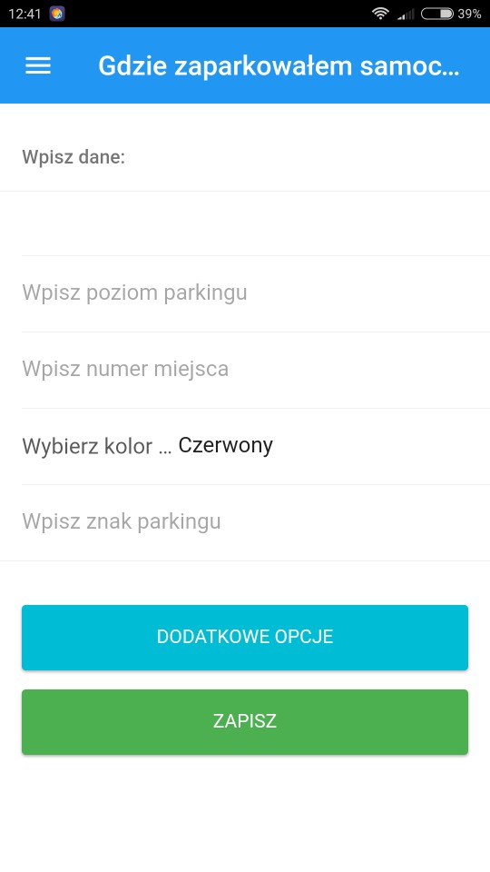
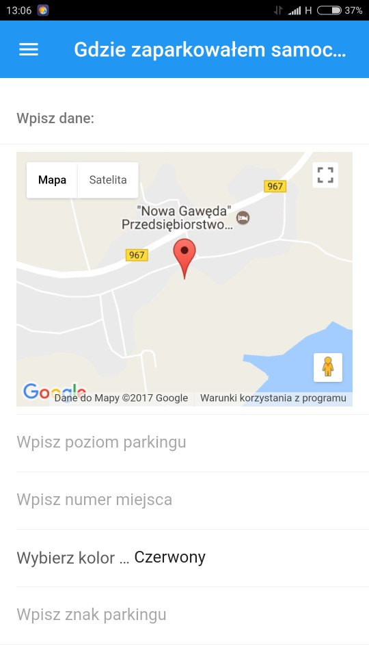

# Gdzie zaparkowałem samochód..?

Program pomaga zlokalizować samochód, na parkingach dużych centr handlowych, gdzie często zdarza się zapomnieć, w którym dokładnie miejscu pojazd został zaparkowany.

## Aplikację można pobrać [tutaj](https://build.phonegap.com/apps/2520364/install)

# Metoda działania

Aplikacja mobilna umożliwia zapisanie pozycji pojazdu na parę sposobów:
* wypełnienie poziomu, numeru miejsca czy specjalnych oznakowań w polach formatki
* uzyskanie markera GPS i wyświetlenie go na mapie
* uruchomienie aparatu urządzenia i wyświetlenie zrobionego zdjęcia

# Specyfikacja

Aplikacja została napisana przy użyciu języków HTML5, JavaScript, CSS.
Do wybudowania wersji mobilnej użyta została platforma PhoneGap firmy Adobe.

# Zrzuty ekranu

## Projekt realizowany na potrzeby przemiotu Architektura środowisk mobilnych (J. Stal)
